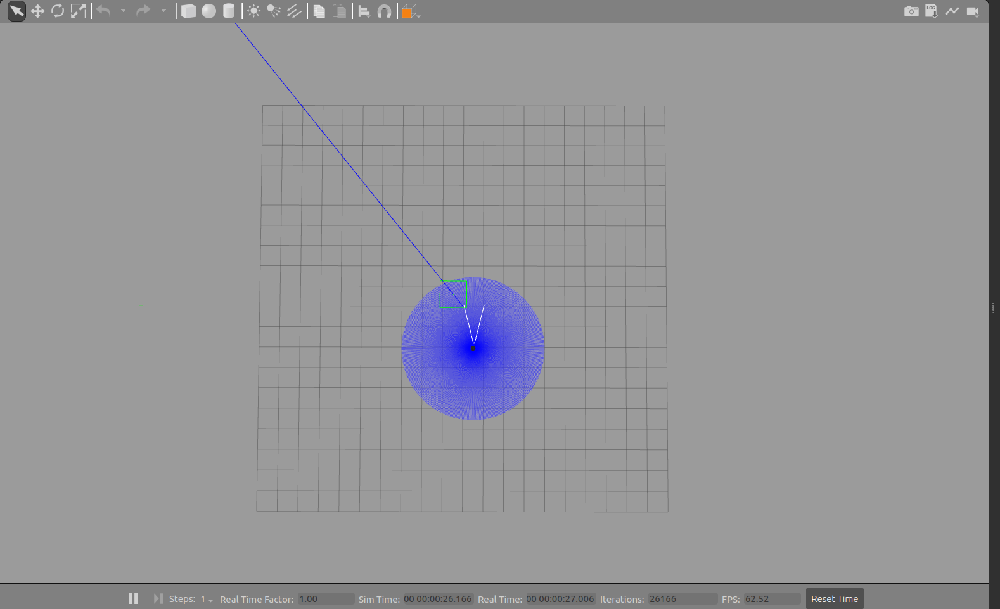
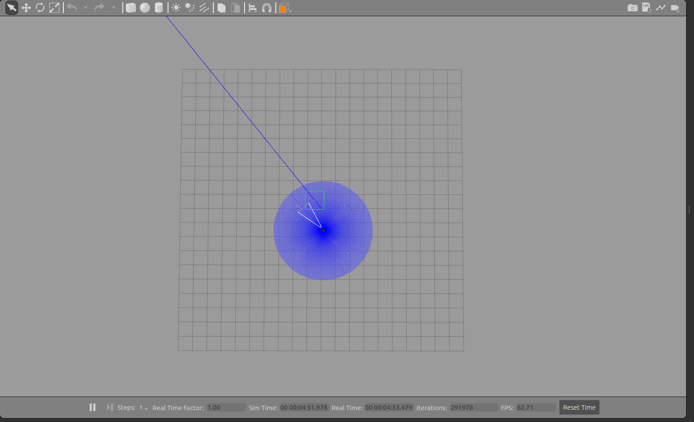
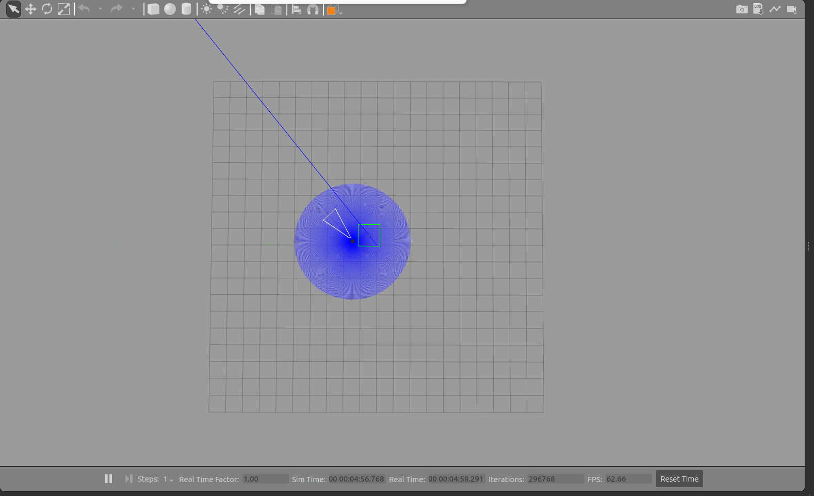
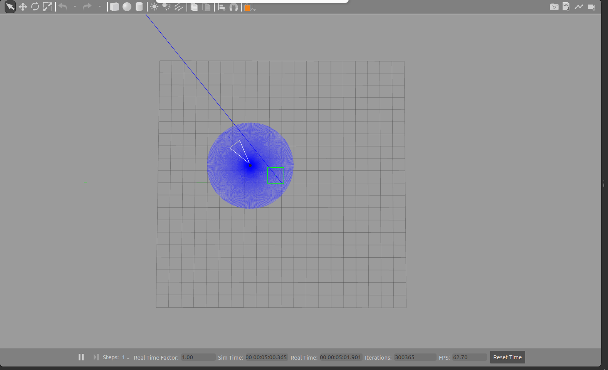
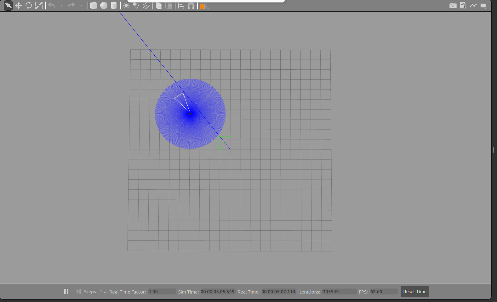
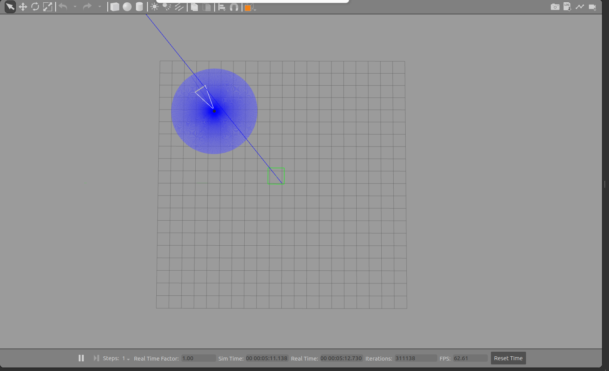
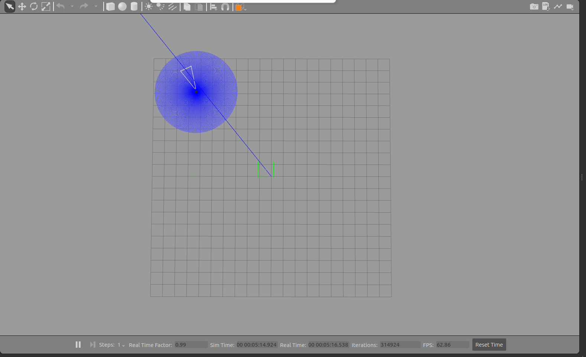
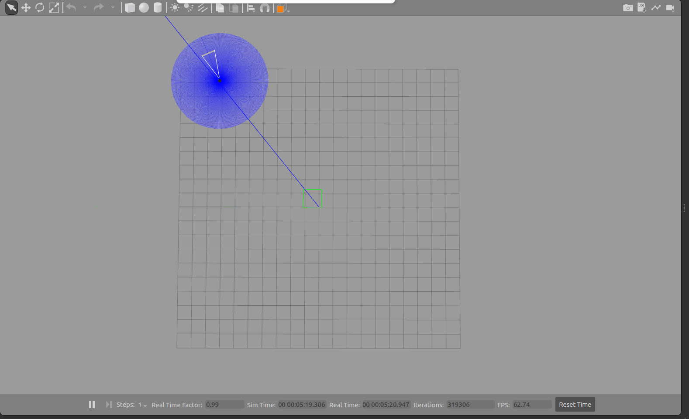
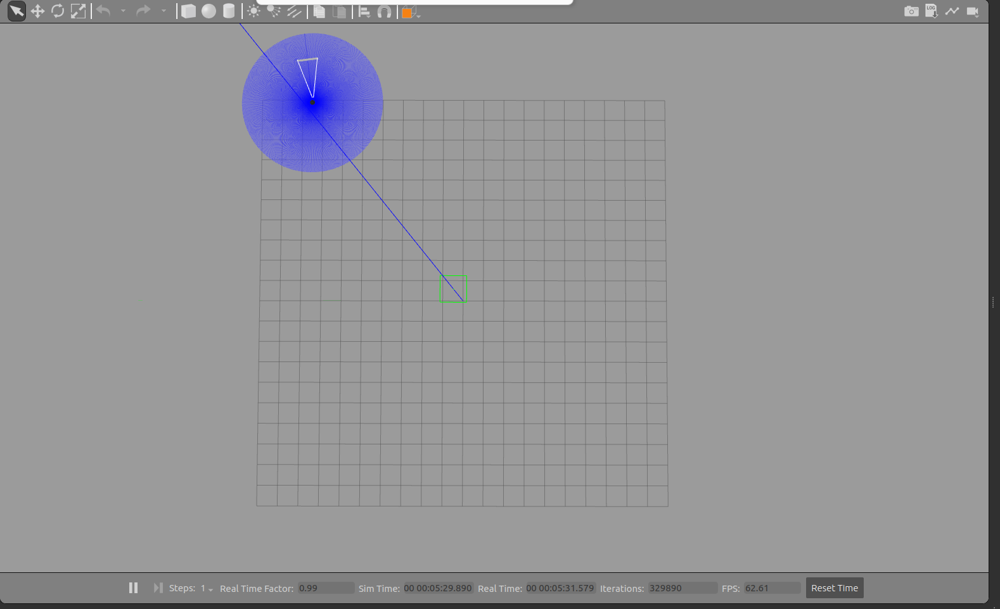

# TurtleBot3 Controller (ROS 2)

Bu proje, ROS 2 kullanılarak geliştirilmiş otonom bir yönelim ve hareket kontrolcüsüdür. TurtleBot3 robotunun Gazebo simülasyon ortamında, belirlenen hedef (X,Y) koordinatlarına otonom olarak dönüp ilerlemesini ve hedefe ulaştığında durmasını sağlar.

## Özellikler
* **Odometry (Odom) Takibi:** Robotun anlık konumunu ve yönelimini hesaplar.
* **Orantılı Kontrol (P-Control):** Hedefe olan uzaklık ve açı farkına göre hızlanma/yavaşlama ve dönüş tepkileri verir.
* **Hassas Konumlanma:** Robot hedefe yaklaşırken hızını kademeli olarak düşürür ve milimetrik hassasiyetle durur.

## Nasıl Çalıştırılır?

**1. Simülasyonu Başlatın:**
```bash
ros2 launch turtlebot3_gazebo turtlebot3_world.launch.py
```

**2. Projeyi Derleyin ve Ortamı Hazırlayın:**
```bash
cd ~/ros2_ws
colcon build --packages-select turtlebot_controller
source install/setup.bash
```

**3. Navigasyon Düğümünü Çalıştırın:**
```bash
ros2 run turtlebot_controller move_robot_node
```

Yazdığımız kodlara göre robotun hareketini adım adım inceleyebilirsiniz:










